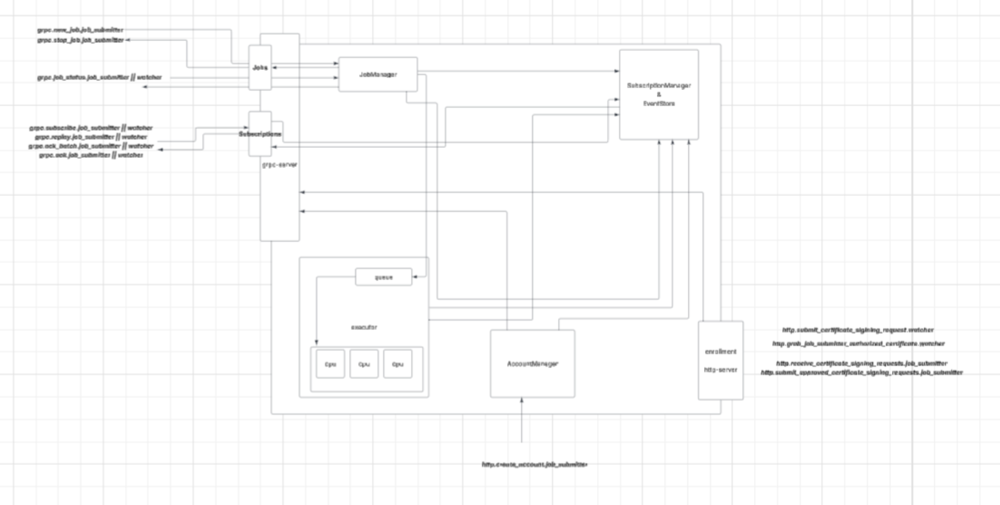

# Teleport

## Index

I. overview

II. authorization, authentication, and resource based access control

III. on client subscriptions for logs and other events

IV. job api and its relation to job manipulation and status tracking

V. job states & lifecycle and their relation to server system internals

VI. client library and sdk 

## I. overview

There are currently 9 different api calls across different internal services (3) and authorization boundaries (`job_submitter` & `watcher`).

### APIs & Internal Services:

(1) `AccountManager`: account manager is for authenticating and authorizing `job_submitters` through `http`

(2) `Enrollment`: exists for `job_submitter` authorize `watchers` through a interactive mTLS protocol that includes the `watcher`, `job_submitter`, and `server` through `http`

(3) `Job`: exists to submit new jobs or cancel existing jobs from a `job_submitter`, and get job statuses from a `job_submitter` or `watcher`

(4) `Subscriptions`: exists to receive events more specifically job log events from the server. events can be acknowledged for at least once delivery guarantees

### Low level Components:

(1) `JobManager`: Registers new jobs and keeps track of job states for later status querying. Upon a new job request from grpc api, jobs are written to disk in the case the server 
falls down for durability guarantees

(2) `SubscriptionManager & EventStore`: Keeps track of all events, event redelivery, acknowledgements, and cleanup for all watchers and job_submitters

(3) `Executor`: Keeps a queue of all jobs that are not running in buckets based of job execution time - jobs are pruned from the queue off a simple SJF (shortest job first) algorithm.

If a jobs execution time is not given it will be placed in the longest bucket. If a jobs execution time does not match its actual execution time nothing happens for now but a logged warning

(4) `Enrollment`: Performs the role based authentication for watchers

(5) `AccountManager`: Authenticates and authorizes new `job_submitter` accounts - anyone can make `job_submitter` accounts for now.



## II. authorization, authentication, and resource based access control

Job submitters and watchers have role based authorization. 

### Roles:

(1) `job_submitters`:

anyone (for now) can be authorized to become a `job_submitter` - when our server is the single CA its assumed the clients role is `job_submitter`

(2) `watcher`:

only those who have `job_submitters` in their CA (certificate authority) chain are authorized to subscribe to different `job_watcher` accounts through 
grpc.  This authorization is done by an interactive protocol between our agents (`job_submitter`, `server`, and `job_watcher`) within the enrollment api

### `enrollment` api and `watcher` protocol:

1. potential `watcher` sends a CSR request to our `enrollment` endpoint for a specified job_submitter account 
(todo: in the future we can query different accounts that exist)
2. already authenticated `job_submitter` GETs (or polls) our server for `watcher` CSRs
3. `job_submitter` approves CSRs (todo: in the future we can deny CSRs)
4. `job_submitter` approved `watcher` GETs (or polls) the `enrollment` endpoint for its cert
5. `watcher` now has cert with CA (certificate authority) and can now watch jobs for this specific account

beginning open api swagger specs for these http servers can be seen in:

```
enrollment-api.yaml
job-account-manager-api.yaml
```

in the root of this directory.


## III. on client subscriptions for logs and other events

both `job_submitter` and `watcher` (if authorized to the requested `job_submitter` account) can subscribe to logs.

once subscribed the server will push log based events to the clients.

clients can: 

* `ack` log based events so at least once delivery is guaranteed in the case the server cannot reach the clients
*  `replay` in the case clients need to sync all missed events upon "being late to the party" or during client restart during a fault
* `ack_batch` in the case a client replays and needs to `ack` a batch of events in one go

## IV. `job api` and its relation to job object manipulation and status tracking

started jobs are submitted to the server and then committed for durability if a job is submitted
this does not necessarily mean it has been initiated as it could sit in the server's queue until
resources are avaliable

jobs can only be created if the user has authenticated with the server
already and created an account through the `account api`

stopped jobs are removed from the program - they cannot be restarted.  if a job is stopped 
an event is emitted in the event store to be streamed along side logs.

only the `job_submitter` is authorized to stop jobs.

status requests system for the current state of the job - both a `watcher` (if authorized) and `job_submitter`

## V. job states & lifecycle and their relation to server system internals

jobs can have the following states:

```
enum JobState {
  JOB_STATE_UNCOMMITTED = 1;
  JOB_STATE_COMMITTED = 1;
  JOB_STATE_PENDING = 1;
  JOB_STATE_RUNNING = 2;
  JOB_STATE_STOPPED = 4;
  JOB_STATE_COMPLETED = 5;
  JOB_STATE_FAILED = 6;
}
```

`uncommitted`: job has yet to be sent from the client or flushed to the servers disk through a WAL

`committed`: job has succesfully been flushed to the servers disk and is durable - if the server
            falls over prejob completion, stop, or failure it can be succesfully replayed upon server
            restart

`pending`: job is currently within its queue in its time designated bucket

`running`: job is running and subscribers can receive soft real time events if currently subscribed
         to the account that this job is owned to

`stopped`: job is stopped from running if job was in any state besides RUNNING an invalid request is 
           sent to who ever made the stop_job grpc request - job status is then updated in job manager

`completed`: job has succesfully completed on the server
`failed`: job has failed on the server

upon server fall over all `committed`, `pending`, or `running` workloads are replayed into the servers queue.
running workloads are currently not check pointed so if the server falls down they will have to be executed
from scratch.

## VI. client library and sdk 

client library provides two different sdks for `watcher` and `job_submitter`. 

both `watcher` and `job_submitter` can stream job logs as well as ACK job stream events by server assigned
sequence number.

when a `job_submitter` submits a job SDK will generate a idempotent key for this workload 

TODO: implement idempotent key deduplication internally in the server

TODO: implement exponential backoffs in the case the client implementing the SDK cannot
      reach the server

in the case that a client leverages this SDK falls over in the time window between using a streamed event in a sink (or other use case) and ACKing 
the event client side deduplication is implemented using a hash set with the event's sequence being the key.

other nuances exist in terms of potential extremely large log event payloads - if a log payload is exceeds a 
configurable size it is split into chunks on the server side.

the sdk is responsible for joining different fragments that belong to the same chunk to keep log messages meaningful.

`job_watcher` can use the above mentioned `account`, `enrollment`, `job`, and `subscription` apis while the
`watcher` can use the `enrollment`, `job` (with limited authorization), and `subscription` apis.

